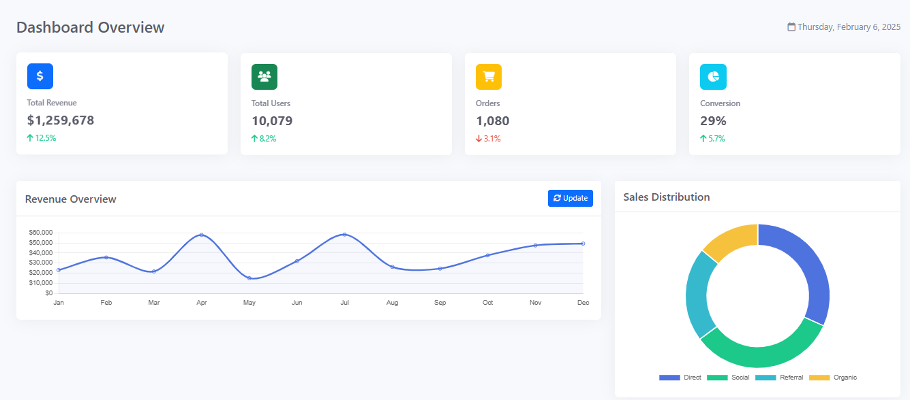
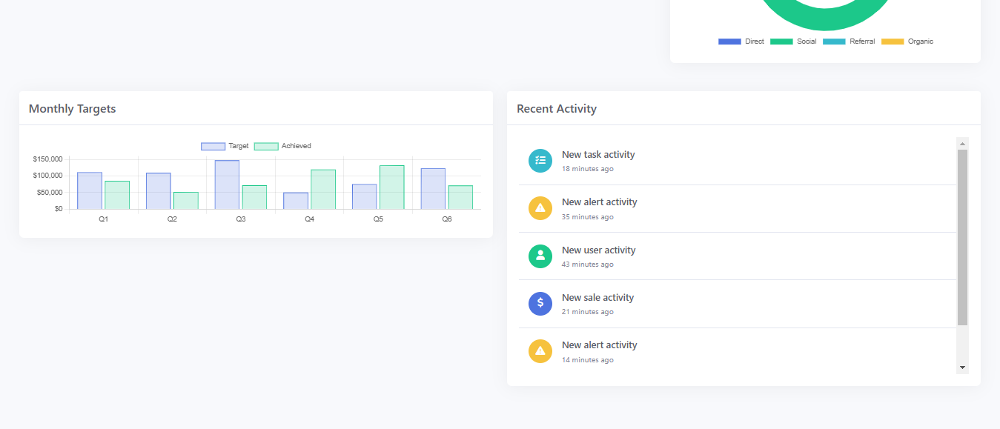

# Dashboard Project

## Project Overview
This project is a responsive dashboard interface built with HTML, CSS, JavaScript, Bootstrap, and Chart.js. It provides real-time statistics, charts, and an activity feed to visualize key metrics dynamically.

## Features
- **Responsive Design:** Works on all screen sizes.
- **Bootstrap Integration:** Uses Bootstrap 5 for styling and layout.
- **Font Awesome Icons:** Adds stylish icons for better UI experience.
- **Dynamic Charts:** Uses Chart.js for displaying revenue, sales distribution, and target progress.
- **Real-time Statistics:** Updates revenue, users, orders, and conversion rates dynamically.
- **Activity Feed:** Displays recent activities and updates automatically.

## Directory Structure
```
├── akshay0497-dashboard-design/
│   ├── index.html       # Main HTML file
│   ├── script.js        # JavaScript logic for dynamic updates
│   ├── styles.css       # Styling and layout
│   ├── screenshot.png   # Preview image of the dashboard
```

## Technologies Used
- HTML5
- CSS3
- JavaScript (ES6+)
- Bootstrap 5
- Chart.js
- Font Awesome 6

## Setup & Installation
1. Clone the repository:
   ```bash
   git clone https://github.com/yourusername/akshay0497-dashboard-design.git
   ```
2. Navigate to the project directory:
   ```bash
   cd akshay0497-dashboard-design
   ```
3. Open `index.html` in your browser.

## Usage
- The dashboard loads with dummy data that updates dynamically.
- Click on the **Update** button in the revenue section to refresh revenue data.
- The activity feed updates every 30 seconds with new random activities.

## Screenshot
Below is a preview of the dashboard:




## Future Enhancements
- Add user authentication.
- Integrate real API data.
- Implement dark mode.


---
For any issues or contributions, feel free to open a pull request or reach out!

